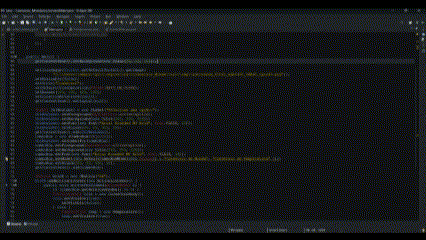

# Challenge ONE Back End - Java

Projeto em Java onde nos foi solicitado para nós Devs a criação de um conversor de moeda utilizando a linguagem Java. As características solicitadas por nosso cliente são as seguintes:

- O conversor de moeda deverá:
  - Converter de Reais a Dólar;
  - Converter de Reais a Euro;
  - Converter de Reais a Libras Esterlinas;
  - Converter de Reais a Ienes Japonês;     
  - Converter de Reais a Won sul-coreano;

Lembrando que deve ser possível também converter de forma inversa ou seja:

  | Moedas         | Conversões                            |
  | -------------- | ------------------------------------- |
  | `BRL` - `USD`  | Converter de Reais a Dólar            |
  | `BRL` - `EUR`  | Converter de Reais a Euro             |
  | `BRL` - `GBP`  | Converter de Reais a Libras Esterlinas|
  | `BRL` - `JPY`  | Converter de Reais a Ienes Japonês    |
  | `BRL` - `KRW`  | Converter de Reais a Won sul-coreano  |
  
 
 
 

# Tecnologia Utilizado neste projeto.
  |              |               |
  | ------------ | ------------- |
  | `Linguaguem` | Java 8        |
  |    `IDE`     | Eclips        |
  |   `Plugin`   | Window Builder|
  |    `GUI`     | SWT Designer  |
    
  
 # EXTRAS
  Implementação do Conversor de Temperatura.
 
 # EM BREVE...
   - Novos conversores como de medida, peso entre outro.
   - Utilização de uma API para que as conversão das moedas possam se atualizar com a variação das mesmas. 
 
